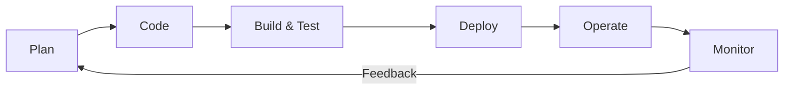

# DevOps & SDLC

## 1. Introduction
- **Objective**: Understand the relationship between DevOps and the Software Development Life Cycle (SDLC).
- **Why it matters**: Modern software development requires speed, quality, and collaboration—DevOps enhances SDLC to achieve these goals.

---

## 2. Understanding the Software Development Life Cycle (SDLC)
### Phases of SDLC:
1. **Planning** – Requirements gathering, feasibility study.
2. **Design** – System architecture, prototypes.
3. **Development** – Coding, version control.
4. **Testing** – QA, bug fixing.
5. **Deployment** – Release to production.
6. **Maintenance** – Updates, patches.

### Traditional SDLC Challenges:
- Slow releases
- Siloed teams (Dev vs. Ops)
- Manual processes leading to errors

---

## 3. Introduction to DevOps
### What is DevOps?
- A culture, practice, and set of tools that **bridge Development (Dev) and Operations (Ops)**.
- **Key Principles**:
  - **Automation** (CI/CD pipelines)
  - **Continuous Integration & Continuous Deployment (CI/CD)**
  - **Monitoring & Feedback**
  - **Collaboration & Shared Responsibility**

### DevOps Workflow
DevOps operates through a **continuous loop** of collaboration, automation, and feedback across the SDLC:

1. **Plan**  
   - Agile methodologies (Scrum/Kanban) prioritize tasks.
   - Tools: Jira, Trello, Azure DevOps.
2. **Code**  
   - Developers use **version control** (Git) for collaborative coding.
   - Tools: GitHub, GitLab, Bitbucket.
3. **Build & Test**  
   - **Continuous Integration (CI)**: Code changes are automatically built, tested, and merged.
   - Automated testing (unit, integration, security).
   - Tools: Jenkins, CircleCI, GitHub Actions.
4. **Deploy**  
   - **Continuous Deployment (CD)**: Automatically release code to production.
   - Strategies: Blue-Green, Canary, Rolling deployments.
   - Tools: Kubernetes, Docker, AWS CodeDeploy.
5. **Operate**  
   - Infrastructure as Code (IaC) manages servers (e.g., Terraform, Ansible).
   - Cloud platforms (AWS/Azure/GCP) enable scalability.
6. **Monitor**  
   - Real-time monitoring of applications and infrastructure.
   - Feedback loops for rapid bug fixes.
   - Tools: Prometheus, Grafana, ELK Stack.

### DevOps Tools:
| Category               | Tools                          |
|------------------------|--------------------------------|
| **Version Control**     | Git, GitHub, GitLab           |
| **CI/CD**              | Jenkins, GitHub Actions       |
| **Configuration Mgmt**  | Ansible, Puppet, Chef         |
| **Containerization**   | Docker, Kubernetes            |
| **Monitoring**         | Prometheus, Grafana, ELK Stack|

---

## 4. Integrating DevOps with SDLC
### DevOps in Each SDLC Phase:
| **SDLC Phase**  | **DevOps Practices**                          |
|----------------|---------------------------------------------|
| Planning       | Infrastructure as Code (IaC), Agile planning|
| Design         | Scalable architecture, cloud solutions     |
| Development    | Version control, peer reviews              |
| Testing        | Automated testing (unit, integration, load)|
| Deployment     | CI/CD pipelines, blue-green deployments    |
| Maintenance    | Logging, monitoring, incident response     |

### Benefits of DevOps in SDLC:
✔ **Faster releases** (Agile & Automation)  
✔ **Higher reliability** (Automated testing & rollback)  
✔ **Better collaboration** (Breaking silos)  

---

## 5. Case Studies and Real-World Examples

### 🎥 Case Study 1: Netflix - Chaos Engineering in Action
**Problem**:  
- 500+ microservices on AWS needed to survive daily failures  
- Traditional testing couldn't simulate real-world cloud outages  

**DevOps Solutions**:  
1. **Chaos Monkey**  
   - Randomly terminates production instances during business hours  
   - Forces engineers to build auto-recovery systems  
   - *Result*: 90% fewer outage minutes despite 10x more deployments  

2. **Spinnaker for CD**  
   - Zero-downtime deployments across 3 AWS regions  
   - Rollback time: **under 60 seconds**  

**Key Takeaway**:  
> *"If you can't survive failures in testing, you shouldn't go live."*  
> Tools: [Chaos Monkey GitHub](https://github.com/Netflix/chaosmonkey) | Spinnaker  

---

### 🛒 Case Study 2: Amazon - From "Merge Hell" to 23,000 Deployments/Day  
**Before DevOps (2006)**:  
- Manual deployments every **11.6 hours**  
- Teams screamed during "merge Thursdays"  

**After DevOps (2023)**:  
- **How They Fixed It**:  
  - "Two-Pizza Teams": Small teams owning microservices  
  - **AWS CodePipeline**: Fully automated deployments  
  - Feature flags: Deploy anytime, release when ready  

**Results**:  
- Deployment failures ↓ 75%  
- New features reach customers 50% faster  

**Diagram**:  

---

## Conclusion
DevOps transforms SDLC by fostering automation, collaboration, and continuous improvement, enabling faster and more reliable software delivery.
